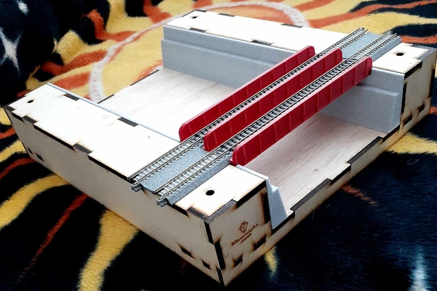

# SFX_Light-sketches #

This repository holds Arduino sketches which are used to create lighting special effects.

At this time four sketches have been uploaded.  The first two below use Adafruit PWM (pulse width modulation) driver devices to control multiple LEDs at the same time.  Both are also written to run on the [Adafruit Itsy Bitsy 32u4 (5V 16MHz version)](https://www.adafruit.com/product/3677) microcontroller.  The third, `TowerStrobes`, is written for the [Adafruit GEMMA v2](https://www.adafruit.com/product/1222adafruit.com/product/1222) and will drive LEDs directly with Darlington transistor drivers.  The fourth, `TowerStrobes_Async`, is a variation of `TowerStrobes`.  The difference is that the Async version allows the two strobe effects (day and night) to run on separate timings, usually at slightly different rates for realism; the non-Async version runs both strobes at the same rate.

## LighthouseBeacon ##
This sketch will be used to create the "rotating" beacon at the top of a lighthouse.  The lighthouse itself is an N-scale (1:160 scale) model which was designed to hold a simple grain-of-rice incandescent bulb with no driving electronics.  I plan to replace that bulb with a small 3D-printed piece which will have 12 white [Nano LEDs](https://evandesigns.com/products/chip-nano-pico-leds?variant=39985935646768) from [Evan Designs](https://evandesigns.com/) (Fort Collins, Colorado, USA) mounted around its tip.

The LEDs are 1.6 mm long, which in N scale would make them equivalent to lights of 256 mm or about 10 inches tall.  The twelve LEDs will be arranged around the printed part facing outwards 30 degrees apart.

The LEDs have thin wires, about 36 gauge, which reach to the base of the model using 2-conductor extensions.  In the base will be an [Adafruit 12-channel 16-bit PWM LED Driver](https://www.adafruit.com/product/1455), connected via SPI to an Itsy Bitsy 32u4 board.

To simulate the rotating lighthouse light, the PWM driver will be used to illuminate the LEDs in sequence around their mount, with each LED fading from off to full on to off again in about 0.8 second.  Each LED will be timed to begin turning on at the moment the one before reaches full-on, which means it will be fully on when the prior goes fully off.  From a distance, this should give the illusion of a light of more-or-less constant brightness rotating once roughly every 5 seconds.

### Dependencies ###

The `LighthouseBeacon` sketch depends on the following libraries.

* SPI (bundled with Arduino IDE)
* [Adafruit_TLC59711](https://github.com/adafruit/Adafruit_TLC59711/)
* [OneShot](https://github.com/twrackers/OneShot-library) (in my GitHub)
* [FadeLED](https://github.com/twrackers/FadeLED-library) (in my GitHub)
* [StateMachine](https://github.com/twrackers/StateMachine-library) (in my GitHub)

## SunGlitter ##
This sketch will be used to simulate sunlight glinting off ripples of water in a canal.  The canal is being built in a [single-width T-TRAK module](https://klawndyke.com/catalog/index.php?main_page=product_info&cPath=4&products_id=20) from [Klawndyke's](https://klawndyke.com/catalog/) (Des Moines, Iowa, USA).  So far I have added KATO Unitrack, a 3D-printed deck bridge (model provided by Klawndyke's), and 3D-printed "stone" walls (models created by myself using Autodesk Fusion 360).

The bottom surface of the canal will be painted over with a water-blue translucent glaze to form the rippled water surface.  Embedded below the glaze, lying on the wooden surface, will be 24 randomly placed Pico LEDs, similar to those used for the `LighthouseBeacon` above but smaller, and ice-blue instead of white.

The `SunGlitter` sketch will randomly make the LEDs fade from off to on (with random peak brightness) to off again, to give the illusion of a brief glint of sunlight reflecting off the surface in that spot.  The LEDs will be driven by an [Adafruit 24-channel 12-bit PWM LED Driver](https://www.adafruit.com/product/1429), again connected by SPI to an Itsy Bitsy 32u4 board.

### Dependencies ###

The `SunGlitter` sketch depends on the following libraries.

* [Adafruit_TLC5947](https://github.com/adafruit/Adafruit_TLC5947)
* [Pulse](https://github.com/twrackers/Pulse-library) (in my GitHub)
* [OneShot](https://github.com/twrackers/OneShot-library) (in my GitHub)
* [FadeLED](https://github.com/twrackers/FadeLED-library) (in my GitHub)
* [StateMachine](https://github.com/twrackers/StateMachine-library) (in my GitHub)

## TowerStrobes ##
This sketch is written to simulate the daytime and nighttime strobes that appear on many tall buildings in Japan, and some in the US as well.  During daylight hours, buildings may have one or more white strobe lights flashing once every 1.5 seconds, while at night the buildings are marked with red lights which are mostly on but dim to nearly off and back on again at about the same rate of 1.5 seconds per cycle.

The sketch is originally written to run on an [Adafruit GEMMA v2](https://www.adafruit.com/product/1222) which has only 3 GPIO pins.

* Pin D0 is used as a PWM output pin to drive red LEDs when the sketch is running in nighttime mode.
* Pin D1 is used as a digital output pin (although it does support PWM as well) to drive white LEDs when the sketch is running in daytime mode.
* Pin D2 (which doubles as analog input A1) is currently used as a digital INPUT_PULLUP pin.  When the pin is pulled up (or left unconnected), the sketch runs in daytime mode.  Pulling the pin to GND switches the sketch to nighttime mode.

The first building in which I plan to install the GEMMA will have 4 red and 4 white LEDs on its roof.  To drive the LEDs, pins D0 and D1 will each connect to 4 input pins of an 8-channel [ULN2803A Darlington transistor array](https://www.sparkfun.com/datasheets/IC/uln2803a.pdf).  Each output pin will connect to the cathode terminal of an LED, with all anodes tied to the GEMMA's 3v3 terminal.  Each of the groups of 4 LEDs, red and white, will light together.

Because pin D2 can be used as analog input A1, a future version of this design might use an analog signal, say from a capacitive touch sensor or a light-level sensor, to switch between daytime and nighttime modes.

### Dependencies ###

The `TowerStrobes` sketch depends on the following libraries.

* [Pulse](https://github.com/twrackers/Pulse-library) (in my GitHub)
* [OneShot](https://github.com/twrackers/OneShot-library) (in my GitHub)
* [FadeLED](https://github.com/twrackers/FadeLED-library) (in my GitHub)
* [StateMachine](https://github.com/twrackers/StateMachine-library) (in my GitHub)

## TowerStrobes_Async ##
This sketch is an alternate version of `TowerStrobes` which supports setting the strobe rates of the day and night light cycles to different values, with the two running independently of each other.  This adds some more realism to the light effects, since on a real building the day and night warning lights would be independent.  There is also a short period where neither strobe flashes when switching between day and night modes.

Other than this asynchronous behavior, all of the information above for `TowerStrobes` applies to `TowerStrobes_Async` as well.
